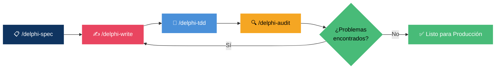

<div align="center">

<picture>
  
</picture>

<br/>

[](CHANGELOG.md)
[](LICENSE)
[](https://github.com/adrianosantostreina/delphi-dev)
[](#-instalación)
[](#-estándares-aplicados-automáticamente)
[](#-prefijos-de-componentes-vcl--fmx)

<br/>

**Deja de escribir Pascal descuidado. Empieza a entregar Delphi de nivel senior.**

*Describe lo que necesitas → El agente aplica todas las reglas → Ve cómo se genera el código correcto.*

<br/>

[Instalación](#-instalación) · [Cómo Funciona](#-cómo-funciona) · [Comandos](#-comandos) · [Estándares](#-estándares-aplicados-automáticamente)

</div>

---

## 🧠 El Problema

> El código Delphi generado por IA tiene mala reputación — y se la merece.

Le pides a una IA que escriba un formulario o una consulta, y obtienes **código que ignora las convenciones**, usa `with` en todas partes, concatena SQL y crea objetos sin `try..finally`. Revisarlo y corregirlo lleva más tiempo que escribirlo tú mismo.

**delphi-ag-dev** soluciona eso. Es la **capa de ingeniería de contexto** que hace que el código Delphi generado por IA sea genuinamente confiable.

<table>
<tr>
<td width="50%">

### ❌ Sin delphi-ag-dev
```
"Crea un formulario de clientes"
    → with statements por todos lados
    → SQL con concatenación de strings
    → try..finally faltante
    → Prefijos de componentes incorrectos
    → Pesadilla en la revisión de código
```

</td>
<td width="50%">

### ✅ Con delphi-ag-dev
```
"Crea un formulario de clientes"
    → /delphi-spec
    → /delphi-write
    → /delphi-tdd
    → /delphi-audit
    → ✅ Listo para producción
```

</td>
</tr>
</table>

> **Sin ceremonias de boilerplate.** Sin archivos de configuración, plugins de IDE ni pasos de build.
> Solo un conjunto efectivo de skills y workflows que hacen que el código Delphi generado por IA sea correcto desde el primer día.

---

## 👤 Para Quién Es

| | |
|---|---|
| 🧑‍💻 **Desarrolladores Delphi** | Que usan asistentes de IA y necesitan código consistente con los estándares |
| 👥 **Equipos Delphi** | Que quieren que toda la IA del equipo siga las mismas reglas de codificación |
| 😤 **Cualquiera** | Cansado de que la IA genere código que viola las convenciones de Delphi |

---

## ⚡ Instalación

```powershell
# Navega a tu proyecto
cd TuProyectoDelphi

# Clona delphi-ag-dev
git clone https://github.com/mrschuster1/delphi-ag-dev.git delphi-ag-temp

# Copia las skills y workflows del agente
Copy-Item -Recurse -Force .\delphi-ag-temp\.agent\* .\.agent\

# Limpieza
Remove-Item -Recurse -Force delphi-ag-temp
```

Listo. El agente ahora reconocerá todos los workflows de Delphi y cargará automáticamente la skill `delphi-standards` en cualquier interacción con Delphi.

> [!TIP]
> La skill `delphi-standards` se activa automáticamente. No necesitas mencionarla en tus prompts — en el momento en que abras un archivo `.pas` o menciones código Delphi, entra en acción.

---

## 🔄 Cómo Funciona



| Paso | Comando | Salida |
|:----:|---------|--------|
| **1** | `/delphi-spec` | Definición de arquitectura → `SPEC.md` con estructura de capas |
| **2** | `/delphi-write` | Archivos `.pas`, `.dfm`, `.fmx` estructurados con todas las convenciones |
| **3** | `/delphi-tdd` | Suite completa de tests DUnitX → Red → Green → Refactor |
| **4** | `/delphi-audit` | Informe de calidad con puntuación dimensional y hoja de ruta de correcciones |

---

## 🧩 Por Qué Funciona

### 📦 Ingeniería de Contexto

La IA es poderosa **si** tiene las reglas correctas cargadas. La mayoría de los desarrolladores no configuran esto. `delphi-ag-dev` lo hace automáticamente a través de la skill `delphi-standards`:

| Categoría de Regla | Qué se Aplica |
|---|---|
| **Nomenclatura** | Prefijos `F`, `A`, `L`, `C_`, `T`, `I`, `E` — siempre |
| **Formato** | Sangría de 2 espacios, límite de 120 chars, `begin`/`else` en líneas propias |
| **Seguridad** | `try..finally` por objeto, sin `except` vacío, SQL parametrizado |
| **Componentes** | Tabla de prefijos VCL/FMX (`btn`, `edt`, `lbl`, `grd`, etc.) |
| **Prohibidos** | `with`, `Break`, `Continue`, `Real` — bloqueados con alternativas |

### 🏷️ Generación de Código Estructurado

Cada unit generada sigue una plantilla estricta:

```pascal
unit Cliente.Repository;

{$IFDEF FPC}{$MODE DELPHI}{$ENDIF}

interface

uses
  // RTL
  System.SysUtils, System.Classes,
  // FireDAC
  FireDAC.Comp.Client,
  // Proyecto
  Cliente.Interfaces;

type
  TClienteRepository = class(TInterfacedObject, IClienteRepository)
  private
    FConnection: TFDConnection;
  public
    constructor Create(const AConnection: TFDConnection);
    function BuscarPorId(const AId: Integer): TClienteDTO;
  end;

implementation

constructor TClienteRepository.Create(const AConnection: TFDConnection);
begin
  FConnection := AConnection;
end;

function TClienteRepository.BuscarPorId(const AId: Integer): TClienteDTO;
var
  LQuery: TFDQuery;
begin
  LQuery := TFDQuery.Create(nil);
  try
    LQuery.Connection := FConnection;
    LQuery.SQL.Text := 'SELECT * FROM clientes WHERE id = :pId';
    LQuery.ParamByName('pId').AsInteger := AId;
    LQuery.Open;
    // ... mapear resultado
  finally
    LQuery.Free;
  end;
end;

end.
```

### 🔬 Auditoría Empírica

`/delphi-audit` puntúa el código en múltiples dimensiones — no solo "parece bien":

| Dimensión | Qué se Verifica |
|:---:|---|
| 🏷️ **Nomenclatura** | Conformidad de prefijos en todos los identificadores |
| 📐 **Formato** | Sangría, longitud de línea, posicionamiento de `begin`/`else` |
| 🔒 **Seguridad** | Cobertura de `try..finally`, parametrización de SQL |
| 🏗️ **Arquitectura** | Separación de capas, dirección de dependencias |
| 🧪 **Testabilidad** | Uso de interfaces, patrones de inyección de dependencias |
| ⚡ **Performance** | Construcción de queries, ciclo de vida de objetos |

---

## 🎮 Comandos

### 🔵 Flujo Principal

| Comando | Propósito |
|---------|---------|
| `/delphi-spec` | 📋 Define la arquitectura antes de escribir una sola línea de código |
| `/delphi-write` | ✍️ Genera units Delphi (`.pas`, `.dfm`, `.fmx`) con todos los estándares |
| `/delphi-tdd` | 🧪 Ciclo TDD completo — suite DUnitX → Red → Green → Refactor |
| `/delphi-audit` | 🔍 Auditoría técnica profunda con puntuación dimensional y hoja de ruta |

### 💡 Sesión Típica

```
/delphi-spec "Módulo de gestión de clientes con CRUD"
    → Define capas, units, interfaces

/delphi-write "TClienteForm — formulario principal con búsqueda y grid"
    → Genera frmCliente.pas + frmCliente.dfm con prefijos correctos

/delphi-tdd "TClienteRepository"
    → Genera TestClienteRepository.pas con suite DUnitX completa

/delphi-audit "frmCliente.pas"
    → Puntúa calidad del código, lista violaciones, proporciona correcciones
```

> [!IMPORTANT]
> Siempre ejecuta `/delphi-spec` primero. El agente no puede escribir la arquitectura correcta si no sabe qué está construyendo.

---

## 📐 Estándares Aplicados Automáticamente

### Prefijos de Nomenclatura

| Prefijo | Se Aplica a | Ejemplo |
|---|---|---|
| `F` | Campos de clase (privados) | `FNombreCliente: string` |
| `A` | Parámetros de métodos | `procedure Guardar(const ANombre: string)` |
| `L` | Variables locales | `LQuery: TFDQuery` |
| `C_` | Constantes | `C_MAX_INTENTOS = 3` |
| `T` | Tipos y clases | `TRepositorioCliente` |
| `I` | Interfaces | `IRepositorioCliente` |
| `E` | Clases de excepción | `EClienteNoEncontrado` |

### Construcciones Prohibidas

| Construcción | Por Qué Está Prohibida | Alternativa |
|---|---|---|
| `with` | Ambigüedad, imposible de depurar | Referencias explícitas de variable |
| `Break` / `Continue` | Flujo de control oculto | Condiciones de bucle adecuadas |
| `Real` | Obsoleto, impreciso | `Double` o `Currency` |
| `Exit` (en medio del método) | Oculta la intención | Guard clauses solo al inicio del método |

### Reglas de Seguridad

- ✅ **Un recurso por `try..finally`** — nunca agrupar múltiples objetos
- ✅ **Sin bloques `except` vacíos** — maneja o registra, nunca silencie
- ✅ **SQL siempre parametrizado** — `ParamByName`, nunca concatenación
- ✅ **Sin `const` en parámetros de interfaz** — compatibilidad con ARC
- ✅ **Sin variables globales** — `class var` o inyección de dependencias

### Prefijos de Componentes (VCL / FMX)

| Prefijo | Componente | Prefijo | Componente |
|---|---|---|---|
| `btn` | TButton | `pgc` | TPageControl |
| `edt` | TEdit | `tab` | TTabSheet |
| `lbl` | TLabel | `tbar` | TToolBar |
| `mmo` | TMemo | `sbar` | TStatusBar |
| `cbx` | TComboBox | `img` | TImage |
| `grd` | TDBGrid / TStringGrid | `tmr` | TTimer |
| `qry` | TFDQuery | `pnl` | TPanel |
| `cnn` | TFDConnection | `dts` | TDataSource |

---

## 📁 Estructura de Archivos

```
.agent/
├── skills/
│   └── delphi-standards/
│       └── SKILL.md          ← Fuente única de la verdad para todas las reglas Delphi
└── workflows/
    ├── delphi-audit.md       ← /delphi-audit
    ├── delphi-tdd.md         ← /delphi-tdd
    ├── delphi-spec.md        ← /delphi-spec
    └── delphi-write.md       ← /delphi-write
```

---

## 🧠 Filosofía

<table>
<tr>
<td>📋</td><td><b>Spec antes del código</b> — Define la arquitectura en <code>/delphi-spec</code> antes de escribir cualquier cosa</td>
</tr>
<tr>
<td>🔬</td><td><b>Reglas sobre memoria</b> — La IA no recuerda tus convenciones; la skill las aplica cada vez</td>
</tr>
<tr>
<td>🧪</td><td><b>Los tests no son opcionales</b> — <code>/delphi-tdd</code> es parte del flujo principal, no una ocurrencia tardía</td>
</tr>
<tr>
<td>🔍</td><td><b>Audita antes de mergear</b> — <code>/delphi-audit</code> captura lo que la revisión de código pasa por alto</td>
</tr>
<tr>
<td>🚫</td><td><b>Sin compromisos en seguridad</b> — <code>try..finally</code>, SQL parametrizado y sin <code>except</code> vacío son innegociables</td>
</tr>
<tr>
<td>🤖</td><td><b>Agnóstico al modelo</b> — Funciona con Gemini, Claude o cualquier LLM capaz en Antigravity</td>
</tr>
</table>

---

## 📚 Documentación

| Recurso | Descripción |
|----------|-------------|
| [README.md](README.md) | English |
| [README.pt-BR.md](README.pt-BR.md) | Português |
| [README.es.md](README.es.md) | Este archivo — Español |
| [Política de Privacidad](privacy-policy.es.md) | Manejo de datos y privacidad |
| [Skill delphi-standards](.agent/skills/delphi-standards/SKILL.md) | Referencia completa de reglas de codificación |

---

## Basado en

- *Delphi Coding Standards v4.0.1* — Adriano Santos
- *Clean Code and Best Practices in Delphi* — Adriano Santos
- *Clean Code* — Robert C. Martin
- *Delphi Style Guide* — Embarcadero

---

<div align="center">

<sub>Adaptado de <a href="https://github.com/adrianosantostreina/delphi-dev">adrianosantostreina/delphi-dev</a> para Google Antigravity</sub>

<br/>

[](https://github.com/mrschuster1/delphi-ag-dev)

</div>
