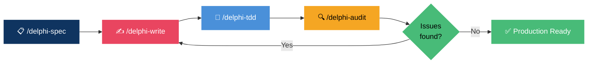

<div align="center">

<picture>
  
</picture>

<br/>

[](CHANGELOG.md)
[](LICENSE)
[](https://github.com/adrianosantostreina/delphi-dev)
[](#-installation)
[](#-standards-applied-automatically)
[](#-component-prefixes-vcl--fmx)

<br/>

🇺🇸 [English](README.md) &nbsp;·&nbsp; 🇧🇷 [Português](README.pt-BR.md) &nbsp;·&nbsp; 🇪🇸 [Español](README.es.md)

<br/>

**Stop writing sloppy Pascal. Start shipping senior-grade Delphi.**


*Describe what you need → The agent applies every rule → Watch it generate correct code.*

<br/>

[Getting Started](#-installation) · [How It Works](#-how-it-works) · [Commands](#-commands) · [Standards](#-standards-applied-automatically)

</div>

---

## 🧠 The Problem

> AI-generated Delphi code has a bad reputation — and it deserves it.

You ask an AI to write a form or a query, and you get **code that ignores conventions**, uses `with` everywhere, concatenates SQL, and creates objects without `try..finally`. Reviewing and fixing it takes longer than writing it yourself.

**delphi-ag-dev** fixes that. It's the **context engineering layer** that makes AI-generated Delphi code actually reliable.

<table>
<tr>
<td width="50%">

### ❌ Without delphi-ag-dev
```
"Create a customer form"
    → with statements everywhere
    → SQL string concatenation
    → Missing try..finally
    → Wrong component prefixes
    → Code review nightmare
```

</td>
<td width="50%">

### ✅ With delphi-ag-dev
```
"Create a customer form"
    → /delphi-spec
    → /delphi-write
    → /delphi-tdd
    → /delphi-audit
    → ✅ Production-ready
```

</td>
</tr>
</table>

> **No boilerplate ceremonies.** No configuration files, no IDE plugins, no build steps.
> Just an effective set of agent skills and workflows that make Delphi AI coding correct from day one.

---

## 👤 Who This Is For

| | |
|---|---|
| 🧑‍💻 **Delphi developers** | Using AI assistants who need consistently standard-compliant code |
| 👥 **Delphi teams** | Who want the whole team's AI output to follow the same coding rules |
| 😤 **Anyone** | Tired of AI generating code that violates Delphi conventions |

---

## ⚡ Installation

```powershell
# Navigate to your project
cd YourDelphiProject

# Clone delphi-ag-dev
git clone https://github.com/mrschuster1/delphi-ag-dev.git delphi-ag-temp

# Copy the agent skills and workflows
Copy-Item -Recurse -Force .\delphi-ag-temp\.agent\* .\.agent\

# Clean up
Remove-Item -Recurse -Force delphi-ag-temp
```

That's it. The agent will now recognize all Delphi workflows and auto-load the `delphi-standards` skill on any Delphi interaction.

> [!TIP]
> The `delphi-standards` skill activates automatically. You don't need to mention it in your prompts — the moment you open a `.pas` file or mention Delphi code, it kicks in.

---

## 🔄 How It Works



| Step | Command | Output |
|:----:|---------|--------|
| **1** | `/delphi-spec` | Architecture definition → `SPEC.md` with layer structure |
| **2** | `/delphi-write` | Scaffolded `.pas`, `.dfm`, `.fmx` files with all conventions |
| **3** | `/delphi-tdd` | Complete DUnitX test suite → Red → Green → Refactor |
| **4** | `/delphi-audit` | Quality report with dimensional scoring and fix roadmap |

---

## 🧩 Why It Works

### 📦 Context Engineering

The AI is powerful **if** it has the right rules loaded. Most developers don't set this up. `delphi-ag-dev` handles it automatically through the `delphi-standards` skill:

| Rule Category | What Gets Enforced |
|---|---|
| **Naming** | `F`, `A`, `L`, `C_`, `T`, `I`, `E` prefixes — every time |
| **Formatting** | 2-space indent, 120-char limit, `begin`/`else` on own lines |
| **Safety** | `try..finally` per object, no empty `except`, parameterized SQL |
| **Components** | VCL/FMX prefix table (`btn`, `edt`, `lbl`, `grd`, etc.) |
| **Prohibited** | `with`, `Break`, `Continue`, `Real` — blocked with alternatives |

### 🏷️ Structured Code Generation

Every unit generated follows a strict template:

```pascal
unit Cliente.Repository;

{$IFDEF FPC}{$MODE DELPHI}{$ENDIF}

interface

uses
  // RTL
  System.SysUtils, System.Classes,
  // FireDAC
  FireDAC.Comp.Client,
  // Project
  Cliente.Interfaces;

type
  TClienteRepository = class(TInterfacedObject, IClienteRepository)
  private
    FConnection: TFDConnection;
  public
    constructor Create(const AConnection: TFDConnection);
    function FindById(const AId: Integer): TClienteDTO;
  end;

implementation

constructor TClienteRepository.Create(const AConnection: TFDConnection);
begin
  FConnection := AConnection;
end;

function TClienteRepository.FindById(const AId: Integer): TClienteDTO;
var
  LQuery: TFDQuery;
begin
  LQuery := TFDQuery.Create(nil);
  try
    LQuery.Connection := FConnection;
    LQuery.SQL.Text := 'SELECT * FROM clientes WHERE id = :pId';
    LQuery.ParamByName('pId').AsInteger := AId;
    LQuery.Open;
    // ... map result
  finally
    LQuery.Free;
  end;
end;

end.
```

### 🔬 Empirical Audit

`/delphi-audit` scores code across multiple dimensions — not just "looks okay":

| Dimension | What's Checked |
|:---:|---|
| 🏷️ **Naming** | Prefix compliance across all identifiers |
| 📐 **Formatting** | Indentation, line length, `begin`/`else` placement |
| 🔒 **Safety** | `try..finally` coverage, SQL parameterization |
| 🏗️ **Architecture** | Layer separation, dependency direction |
| 🧪 **Testability** | Interface usage, dependency injection patterns |
| ⚡ **Performance** | Query construction, object lifecycle |

---

## 🎮 Commands

### 🔵 Core Workflow

| Command | Purpose |
|---------|---------|
| `/delphi-spec` | 📋 Define architecture before writing a single line of code |
| `/delphi-write` | ✍️ Generate Delphi units (`.pas`, `.dfm`, `.fmx`) with all standards |
| `/delphi-tdd` | 🧪 Full TDD cycle — DUnitX test suite → Red → Green → Refactor |
| `/delphi-audit` | 🔍 Deep technical audit with dimensional scoring and fix roadmap |

### 💡 Typical Session

```
/delphi-spec "Customer management module with CRUD"
    → Defines layers, units, interfaces

/delphi-write "TClienteForm — main form with search and grid"
    → Generates frmCliente.pas + frmCliente.dfm with correct prefixes

/delphi-tdd "TClienteRepository"
    → Generates TestClienteRepository.pas with full DUnitX suite

/delphi-audit "frmCliente.pas"
    → Scores code quality, lists violations, provides fixes
```

> [!IMPORTANT]
> Always run `/delphi-spec` first. The agent can't write the right architecture if it doesn't know what it's building.

---

## 📐 Standards Applied Automatically

### Naming Prefixes

| Prefix | Applies To | Example |
|---|---|---|
| `F` | Class fields (private) | `FClientName: string` |
| `A` | Method parameters | `procedure Save(const AName: string)` |
| `L` | Local variables | `LQuery: TFDQuery` |
| `C_` | Constants | `C_MAX_RETRIES = 3` |
| `T` | Types and classes | `TClientRepository` |
| `I` | Interfaces | `IClientRepository` |
| `E` | Exception classes | `EClientNotFound` |

### Prohibited Constructs

| Construct | Why Banned | Alternative |
|---|---|---|
| `with` | Ambiguity, impossible to debug | Explicit variable references |
| `Break` / `Continue` | Hidden control flow | Proper loop conditions |
| `Real` | Deprecated, imprecise | `Double` or `Currency` |
| `Exit` (mid-method) | Hides intent | Guard clauses at method top only |

### Safety Rules

- ✅ **One resource per `try..finally`** — never group multiple object creations
- ✅ **No empty `except` blocks** — handle or log, never swallow
- ✅ **SQL always parameterized** — `ParamByName`, never concatenation
- ✅ **No `const` on interface params** — ARC compatibility
- ✅ **No global variables** — `class var` or dependency injection

### Component Prefixes (VCL / FMX)

| Prefix | Component | Prefix | Component |
|---|---|---|---|
| `btn` | TButton | `pgc` | TPageControl |
| `edt` | TEdit | `tab` | TTabSheet |
| `lbl` | TLabel | `tbar` | TToolBar |
| `mmo` | TMemo | `sbar` | TStatusBar |
| `cbx` | TComboBox | `img` | TImage |
| `grd` | TDBGrid / TStringGrid | `tmr` | TTimer |
| `qry` | TFDQuery | `pnl` | TPanel |
| `cnn` | TFDConnection | `dts` | TDataSource |

---

## 📁 File Structure

```
.agent/
├── skills/
│   └── delphi-standards/
│       └── SKILL.md          ← Single source of truth for all Delphi rules
└── workflows/
    ├── delphi-audit.md       ← /delphi-audit
    ├── delphi-tdd.md         ← /delphi-tdd
    ├── delphi-spec.md        ← /delphi-spec
    └── delphi-write.md       ← /delphi-write
```

---

## 🧠 Philosophy

<table>
<tr>
<td>📋</td><td><b>Spec before code</b> — Define the architecture in <code>/delphi-spec</code> before writing anything</td>
</tr>
<tr>
<td>🔬</td><td><b>Rules over memory</b> — The AI doesn't remember your conventions; the skill enforces them every time</td>
</tr>
<tr>
<td>🧪</td><td><b>Tests are not optional</b> — <code>/delphi-tdd</code> is part of the core workflow, not an afterthought</td>
</tr>
<tr>
<td>🔍</td><td><b>Audit before merging</b> — <code>/delphi-audit</code> catches what code review misses</td>
</tr>
<tr>
<td>🚫</td><td><b>No compromises on safety</b> — <code>try..finally</code>, parameterized SQL, and no empty <code>except</code> are non-negotiable</td>
</tr>
<tr>
<td>🤖</td><td><b>Model-agnostic</b> — Works with Gemini, Claude, or any capable LLM in Antigravity</td>
</tr>
</table>

---

## 📚 Documentation

| Resource | Description |
|----------|-------------|
| [README.md](README.md) | This file — English |
| [README.pt-BR.md](README.pt-BR.md) | Português |
| [README.es.md](README.es.md) | Español |
| [Privacy Policy](privacy-policy.md) | Data handling and privacy |
| [delphi-standards Skill](.agent/skills/delphi-standards/SKILL.md) | Full coding rules reference |

---

## Based on

- *Delphi Coding Standards v4.0.1* — Adriano Santos
- *Clean Code and Best Practices in Delphi* — Adriano Santos
- *Clean Code* — Robert C. Martin
- *Delphi Style Guide* — Embarcadero

---

<div align="center">

<sub>Adapted from <a href="https://github.com/adrianosantostreina/delphi-dev">adrianosantostreina/delphi-dev</a> for Google Antigravity</sub>

<br/>

[](https://github.com/mrschuster1/delphi-ag-dev)

</div>
