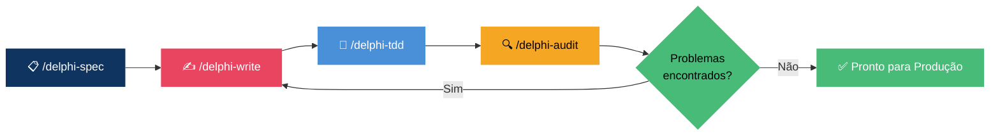

<div align="center">

<picture>
  
</picture>

<br/>

[](CHANGELOG.md)
[](LICENSE)
[](https://github.com/adrianosantostreina/delphi-dev)
[](#-instalação)
[](#-padrões-aplicados-automaticamente)
[](#-prefixos-de-componentes-vcl--fmx)

<br/>

**Pare de escrever Pascal desleixado. Comece a entregar Delphi de nível sênior.**

*Descreva o que precisa → O agente aplica todas as regras → Veja o código correto ser gerado.*

<br/>

[Instalação](#-instalação) · [Como Funciona](#-como-funciona) · [Comandos](#-comandos) · [Padrões](#-padrões-aplicados-automaticamente)

</div>

---

## 🧠 O Problema

> Código Delphi gerado por IA tem má reputação — e merece.

Você pede a uma IA para escrever um formulário ou uma query, e recebe **código que ignora convenções**, usa `with` em tudo, concatena SQL e cria objetos sem `try..finally`. Revisar e corrigir leva mais tempo do que escrever do zero.

**delphi-ag-dev** resolve isso. É a **camada de engenharia de contexto** que torna o código Delphi gerado por IA genuinamente confiável.

<table>
<tr>
<td width="50%">

### ❌ Sem delphi-ag-dev
```
"Crie um formulário de clientes"
    → with statements em todo lugar
    → SQL com concatenação de strings
    → try..finally faltando
    → Prefixos de componentes errados
    → Pesadelo na revisão de código
```

</td>
<td width="50%">

### ✅ Com delphi-ag-dev
```
"Crie um formulário de clientes"
    → /delphi-spec
    → /delphi-write
    → /delphi-tdd
    → /delphi-audit
    → ✅ Pronto para produção
```

</td>
</tr>
</table>

> **Sem cerimônias de boilerplate.** Sem arquivos de configuração, plugins de IDE ou etapas de build.
> Apenas um conjunto eficaz de skills e workflows que tornam o código Delphi gerado por IA correto desde o primeiro dia.

---

## 👤 Para Quem É

| | |
|---|---|
| 🧑‍💻 **Desenvolvedores Delphi** | Que usam assistentes de IA e precisam de código consistente com os padrões |
| 👥 **Times Delphi** | Que querem que toda a IA da equipe siga as mesmas regras de codificação |
| 😤 **Qualquer pessoa** | Cansada de IA gerando código que viola as convenções Delphi |

---

## ⚡ Instalação

<details>
<summary><b>🪟 PowerShell (Windows)</b></summary>

```powershell
# Acesse seu projeto
cd SeuProjetoDelphi

# Clone o delphi-ag-dev
git clone https://github.com/mrschuster1/delphi-ag-dev.git delphi-ag-temp

# Copie as skills e workflows do agente
Copy-Item -Recurse -Force .\delphi-ag-temp\.agent\* .\.agent\

# Limpeza
Remove-Item -Recurse -Force delphi-ag-temp
```

</details>

<details>
<summary><b>🐧 Bash (Linux / macOS)</b></summary>

```bash
# Acesse seu projeto
cd SeuProjetoDelphi

# Clone o delphi-ag-dev
git clone https://github.com/mrschuster1/delphi-ag-dev.git delphi-ag-temp

# Copie as skills e workflows do agente
cp -r delphi-ag-temp/.agent/* ./.agent/

# Limpeza
rm -rf delphi-ag-temp
```

</details>

Pronto. O agente agora reconhecerá todos os workflows Delphi e carregará automaticamente a skill `delphi-standards` em qualquer interação Delphi.

> [!TIP]
> A skill `delphi-standards` é ativada automaticamente. Você não precisa mencioná-la nos seus prompts — no momento em que você abrir um arquivo `.pas` ou mencionar código Delphi, ela entra em ação.

---

## 🔄 Como Funciona



| Passo | Comando | Saída |
|:----:|---------|--------|
| **1** | `/delphi-spec` | Definição de arquitetura → `SPEC.md` com estrutura de camadas |
| **2** | `/delphi-write` | Arquivos `.pas`, `.dfm`, `.fmx` estruturados com todas as convenções |
| **3** | `/delphi-tdd` | Suite completa de testes DUnitX → Red → Green → Refactor |
| **4** | `/delphi-audit` | Relatório de qualidade com pontuação por dimensão e roadmap de correções |

---

## 🧩 Por Que Funciona

### 📦 Engenharia de Contexto

A IA é poderosa **se** tiver as regras certas carregadas. A maioria dos desenvolvedores não configura isso. `delphi-ag-dev` faz isso automaticamente pela skill `delphi-standards`:

| Categoria de Regra | O Que é Aplicado |
|---|---|
| **Nomenclatura** | Prefixos `F`, `A`, `L`, `C_`, `T`, `I`, `E` — sempre |
| **Formatação** | Indentação de 2 espaços, limite de 120 chars, `begin`/`else` em linhas próprias |
| **Segurança** | `try..finally` por objeto, sem `except` vazio, SQL parametrizado |
| **Componentes** | Tabela de prefixos VCL/FMX (`btn`, `edt`, `lbl`, `grd`, etc.) |
| **Proibidos** | `with`, `Break`, `Continue`, `Real` — bloqueados com alternativas |

### 🏷️ Geração de Código Estruturado

Cada unit gerada segue um template rigoroso:

```pascal
unit Cliente.Repository;

{$IFDEF FPC}{$MODE DELPHI}{$ENDIF}

interface

uses
  // RTL
  System.SysUtils, System.Classes,
  // FireDAC
  FireDAC.Comp.Client,
  // Projeto
  Cliente.Interfaces;

type
  TClienteRepository = class(TInterfacedObject, IClienteRepository)
  private
    FConnection: TFDConnection;
  public
    constructor Create(const AConnection: TFDConnection);
    function BuscarPorId(const AId: Integer): TClienteDTO;
  end;

implementation

constructor TClienteRepository.Create(const AConnection: TFDConnection);
begin
  FConnection := AConnection;
end;

function TClienteRepository.BuscarPorId(const AId: Integer): TClienteDTO;
var
  LQuery: TFDQuery;
begin
  LQuery := TFDQuery.Create(nil);
  try
    LQuery.Connection := FConnection;
    LQuery.SQL.Text := 'SELECT * FROM clientes WHERE id = :pId';
    LQuery.ParamByName('pId').AsInteger := AId;
    LQuery.Open;
    // ... mapear resultado
  finally
    LQuery.Free;
  end;
end;

end.
```

### 🔬 Auditoria Empírica

`/delphi-audit` pontua o código em múltiplas dimensões — não apenas "parece ok":

| Dimensão | O Que é Verificado |
|:---:|---|
| 🏷️ **Nomenclatura** | Conformidade de prefixos em todos os identificadores |
| 📐 **Formatação** | Indentação, tamanho de linha, posicionamento de `begin`/`else` |
| 🔒 **Segurança** | Cobertura de `try..finally`, parametrização de SQL |
| 🏗️ **Arquitetura** | Separação de camadas, direção de dependências |
| 🧪 **Testabilidade** | Uso de interfaces, padrões de injeção de dependência |
| ⚡ **Performance** | Construção de queries, ciclo de vida de objetos |

---

## 🎮 Comandos

### 🔵 Fluxo Principal

| Comando | Finalidade |
|---------|---------|
| `/delphi-spec` | 📋 Define arquitetura antes de escrever uma única linha de código |
| `/delphi-write` | ✍️ Gera units Delphi (`.pas`, `.dfm`, `.fmx`) com todos os padrões |
| `/delphi-tdd` | 🧪 Ciclo TDD completo — suite DUnitX → Red → Green → Refactor |
| `/delphi-audit` | 🔍 Auditoria técnica profunda com pontuação por dimensão e roadmap de correções |

### 💡 Sessão Típica

```
/delphi-spec "Módulo de gestão de clientes com CRUD"
    → Define camadas, units, interfaces

/delphi-write "TClienteForm — formulário principal com busca e grid"
    → Gera frmCliente.pas + frmCliente.dfm com prefixos corretos

/delphi-tdd "TClienteRepository"
    → Gera TestClienteRepository.pas com suite DUnitX completa

/delphi-audit "frmCliente.pas"
    → Pontua qualidade do código, lista violações, fornece correções
```

> [!IMPORTANT]
> Sempre execute `/delphi-spec` primeiro. O agente não consegue escrever a arquitetura certa se não sabe o que está construindo.

---

## 📐 Padrões Aplicados Automaticamente

### Prefixos de Nomenclatura

| Prefixo | Aplica-se a | Exemplo |
|---|---|---|
| `F` | Campos de classe (privados) | `FNomeCliente: string` |
| `A` | Parâmetros de métodos | `procedure Salvar(const ANome: string)` |
| `L` | Variáveis locais | `LQuery: TFDQuery` |
| `C_` | Constantes | `C_MAX_TENTATIVAS = 3` |
| `T` | Tipos e classes | `TRepositorioCliente` |
| `I` | Interfaces | `IRepositorioCliente` |
| `E` | Classes de exceção | `EClienteNaoEncontrado` |

### Construções Proibidas

| Construção | Por Que é Proibida | Alternativa |
|---|---|---|
| `with` | Ambiguidade, impossível de debugar | Referências explícitas de variável |
| `Break` / `Continue` | Fluxo de controle oculto | Condições de loop adequadas |
| `Real` | Obsoleto, impreciso | `Double` ou `Currency` |
| `Exit` (meio do método) | Esconde a intenção | Guard clauses apenas no início do método |

### Regras de Segurança

- ✅ **Um recurso por `try..finally`** — nunca agrupe múltiplos objetos
- ✅ **Sem blocos `except` vazios** — trate ou registre, nunca silencie
- ✅ **SQL sempre parametrizado** — `ParamByName`, nunca concatenação
- ✅ **Sem `const` em parâmetros de interface** — compatibilidade com ARC
- ✅ **Sem variáveis globais** — `class var` ou injeção de dependência

### Prefixos de Componentes (VCL / FMX)

| Prefixo | Componente | Prefixo | Componente |
|---|---|---|---|
| `btn` | TButton | `pgc` | TPageControl |
| `edt` | TEdit | `tab` | TTabSheet |
| `lbl` | TLabel | `tbar` | TToolBar |
| `mmo` | TMemo | `sbar` | TStatusBar |
| `cbx` | TComboBox | `img` | TImage |
| `grd` | TDBGrid / TStringGrid | `tmr` | TTimer |
| `qry` | TFDQuery | `pnl` | TPanel |
| `cnn` | TFDConnection | `dts` | TDataSource |

---

## 📁 Estrutura de Arquivos

```
.agent/
├── skills/
│   └── delphi-standards/
│       └── SKILL.md          ← Fonte única da verdade para todas as regras Delphi
└── workflows/
    ├── delphi-audit.md       ← /delphi-audit
    ├── delphi-tdd.md         ← /delphi-tdd
    ├── delphi-spec.md        ← /delphi-spec
    └── delphi-write.md       ← /delphi-write
```

---

## 🧠 Filosofia

<table>
<tr>
<td>📋</td><td><b>Spec antes do código</b> — Defina a arquitetura em <code>/delphi-spec</code> antes de escrever qualquer coisa</td>
</tr>
<tr>
<td>🔬</td><td><b>Regras acima de memória</b> — A IA não lembra das suas convenções; a skill as aplica toda vez</td>
</tr>
<tr>
<td>🧪</td><td><b>Testes não são opcionais</b> — <code>/delphi-tdd</code> faz parte do fluxo principal, não é uma reflexão tardia</td>
</tr>
<tr>
<td>🔍</td><td><b>Audite antes de mergear</b> — <code>/delphi-audit</code> captura o que a revisão de código perde</td>
</tr>
<tr>
<td>🚫</td><td><b>Sem compromissos com segurança</b> — <code>try..finally</code>, SQL parametrizado e sem <code>except</code> vazio são inegociáveis</td>
</tr>
<tr>
<td>🤖</td><td><b>Agnóstico a modelo</b> — Funciona com Gemini, Claude ou qualquer LLM capaz no Antigravity</td>
</tr>
</table>

---

## 📚 Documentação

| Recurso | Descrição |
|----------|-------------|
| [README.md](README.md) | English |
| [README.pt-BR.md](README.pt-BR.md) | Este arquivo — Português |
| [README.es.md](README.es.md) | Español |
| [Política de Privacidade](privacy-policy.pt-BR.md) | Tratamento de dados e privacidade |
| [Skill delphi-standards](.agent/skills/delphi-standards/SKILL.md) | Referência completa das regras de codificação |

---

## Baseado em

- *Delphi Coding Standards v4.0.1* — Adriano Santos
- *Clean Code and Best Practices in Delphi* — Adriano Santos
- *Clean Code* — Robert C. Martin
- *Delphi Style Guide* — Embarcadero

---

<div align="center">

<sub>Adaptado de <a href="https://github.com/adrianosantostreina/delphi-dev">adrianosantostreina/delphi-dev</a> para o Google Antigravity</sub>

<br/>

[](https://github.com/mrschuster1/delphi-ag-dev)

</div>
